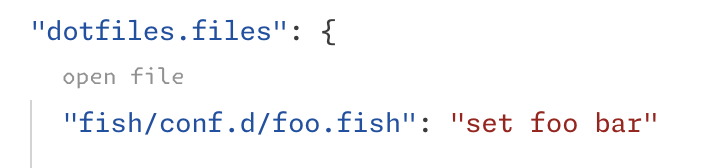

# dotfiles

Configure dotfiles from your VS Code settings so they're always available.

Run **dotfiles: Apply Config** from the command palette to write files to disk as defined in config (`dotfiles.files`).

If `dotfiles.autoUpdate` is enabled, automatically apply config from settings to files on workbench open, and write changes to settings when saving a file in the editor that matches a file defined in `dotfiles.files`.

## Example

```json
"dotfiles.files": {
	"path/to/file.txt": "foo\nbar\n"
}
```

writes file `$XDG_CONFIG_HOME/path/to/file.txt` with the content of the key. File paths are always POSIX.

A code lens is added to keys in settings.json under `dotfiles.files` to open the file in an editor. Saving the file in the editor will apply changes back to settings.json if `dotfiles.autoUpdate` is enabled.



## Browsing files as a filesystem

Run **dotfiles: Browse Files** from the command palette (or the code lens on the `dotfiles.files` key in settings.json) to add a `dotfiles:` workspace folder showing the files defined in settings as a virtual filesystem. Keys containing `/` appear as directories. Editing and saving a file in this folder writes the change back to `dotfiles.files` directly, without needing `dotfiles.autoUpdate`, and changes to the setting (for example arriving via Settings Sync) refresh open editors.

Since only files are stored in settings, a directory created in the virtual folder persists only until a file is created inside it or the window is reloaded.

## Extension Settings

||Description|Default|
|-|-|-|
|`dotfiles.directory`|Base directory path for all config files to be written.|`""`, meaning `$XDG_CONFIG_HOME` or `$HOME/.config` if unset.|
|`dotfiles.files`|Files to be written to the configured directory, where key is the relative path to the file and value is the content of the file.|`{}`|
|`dotfiles.autoUpdate`|Whether to automatically apply changes to files on workbench open, and persist changes back into settings from the editor.|`false`|
